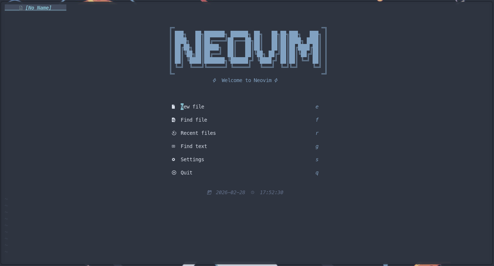
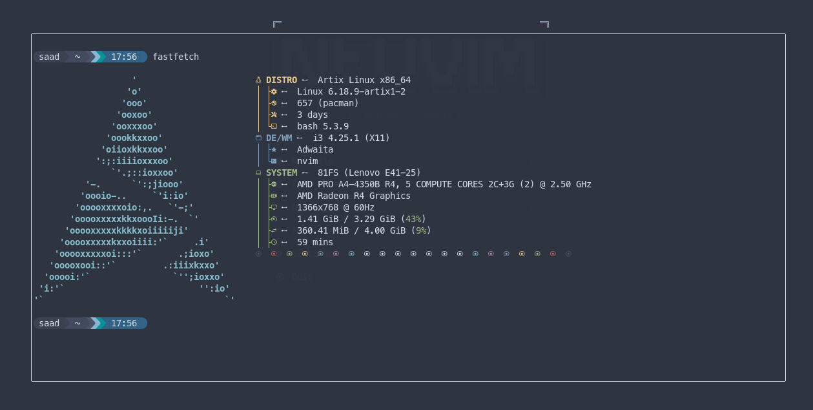

# nordic-nvim ❄️

<div align="center">
  <h3>A fast, modular Neovim configuration</h3>
  <p>
    
    
    
    
    
  </p>
  <p>
    <b>⚡ Fast • 📦 Modular • 🔧 Batteries-included • ❄️ Beautiful</b>
  </p>
</div>

## 📋 About

**nordic-nvim** is a complete Neovim configuration designed for speed, modularity, and visual consistency. It transforms Neovim into a full-featured IDE while maintaining a startup time under 50ms.

> ⚠️ **This is NOT just a theme** - it's a complete Neovim distribution!

## ✨ Features

### Core Features
- **🚀 Blazing Fast** - Startup in under 50ms with lazy.nvim
- **❄️ Nord Theme** - Full Nord integration across ALL plugins
- **📦 Modular Design** - Every plugin has its own config file
- **🔧 Zero Config** - Works out of the box, easy to customize

### IDE Features
- **🔧 Complete LSP Setup** - 15+ language servers pre-configured
- **⚡ Smart Completion** - nvim-cmp with snippets and LSP support
- **🔍 Fuzzy Finding** - Telescope with ripgrep integration
- **📁 File Explorer** - Neo-tree with git status and icons
- **💻 Terminal** - Floating terminal with toggleterm
- **🎨 Syntax Highlighting** - Treesitter for 20+ languages
- **🧠 Code Intelligence** - Go to definition, hover, rename, references
- **🔨 Git Integration** - Gitsigns with inline blame, hunks
- **✨ Autopairs & Comments** - Smart bracket pairing and commenting
- **🎯 Error Lens** - Realtime Inline error highlighting (toggle with `<leader>ue`)
- **🔍 Search & Replace** - Advanced search with preview

### UI Enhancements
- **🎭 Noice.nvim** - Beautiful floating command line and messages
- **📊 Lualine** - Customizable status line
- **📑 Bufferline** - VSCode-like tabs with file icons
- **🔔 Notifications** - nvim-notify with Nord theme
- **🏠 Dashboard** - alpha-nvim with welcome screen and shortcuts
- **💡 Which-key** - Keybinding helper that shows available commands

## 📸 Screenshots

<div align="center">
  <p><i>Screenshots</i></p>
  
  
  
  
  
</div>

## 🚀 Installation

### Prerequisites
- Neovim **0.11+** ([Install guide](https://github.com/neovim/neovim/wiki/Installing-Neovim))
- A [Nerd Font](https://www.nerdfonts.com/) (for icons)
- `ripgrep` (for Telescope live grep)
- `make` (for telescope-fzf-native)
- `node` & `npm` (for language servers)

### One-liner Install

```bash
# Backup existing config (if any)
mv ~/.config/nvim ~/.config/nvim.bak
mv ~/.local/share/nvim ~/.local/share/nvim.bak

# Clone the config
git clone https://github.com/Saad-Dev-8/nordic-nvim.git ~/.config/nvim

# Start Neovim (plugins will install automatically)
nvim
